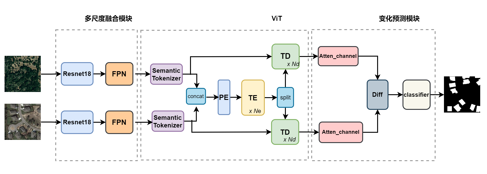

"# MSFT"
"# MSFT"


# Change Detection for Remote Sensing Image

This work is based on BIT model,which is in https://github.com/justchenhao/BIT_CD.git.



## Requirements

```
Python 3.6
pytorch 1.6.0
torchvision 0.7.0
einops  0.3.0
fightingcv_attention
```

## Installation

Clone this repo:

```shell
git clone https://github.com/Jasmine-wrl/MSFT.git
```

## Quick Start

We have some samples from the [LEVIR-CD](https://justchenhao.github.io/LEVIR/) dataset in the folder `samples` for a quick start.

our  pretrained model is in `checkpoints/MSFT/best_ckpt.pt `.

Then, run a demo to get started as follows:

```python
python demo.py 
```

After that, you can find the prediction results in `samples/predict`.

## Train

You can find the training script `job_train.sh` .

## Test

You can find the training script `job_test.sh` .

## Dataset Preparation

### Data structure

```
"""
Change detection data set with pixel-level binary labels；
├─A
├─B
├─label
└─list
"""
```

`A`: images of t1 phase;

`B`:images of t2 phase;

`label`: label maps;

`list`: contains `train.txt, val.txt and test.txt`, each file records the image names (XXX.png) in the change detection dataset.

### Data Download

In this work,I cropped the original images into 256*256 and then fed them into the network.

The original dataset  are as follows:

LEVIR-CD: https://justchenhao.github.io/LEVIR/

DSIFN-CD: https://github.com/GeoZcx/A-deeply-supervised-image-fusion-network-for-change-detection-in-remote-sensing-images/tree/master/dataset

The  cropped dataset(256*256) are as follows:

LEVIR-CD-256:  https://pan.baidu.com/s/1X81ZDz8a4M3Oxxz7ZxBCdA (code:9ha7)

DSIFN-CD-256: https://pan.baidu.com/s/1KMV0HIMk3SkAxxxvkPMuow (code:jv38)

## License

Code is released for non-commercial and research purposes **only**. For commercial purposes, please contact the authors.
